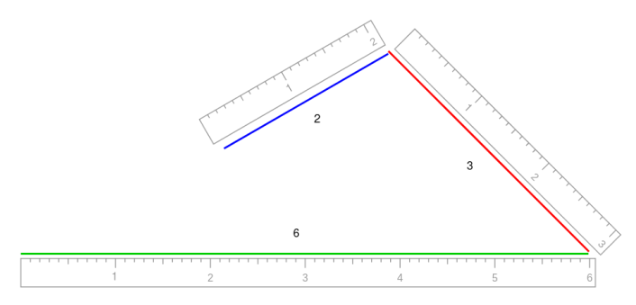

============
Conditionals
============

This is a very basic and essential logical concept used in programming. It's used to represent decision trees. 
Consider this diagram example as a decision tree:

.. figure:: conditional.png
   :scale: 100 %
   :alt: Conditional analogy

In programming, "Did Ryan start the fire?" could be represented as a boolean variable. 
If True, then the result could be the string "Sing 'Ryan started the fire' ". But if False, then "It was the toaster".
Let's hop into some Python examples:

.. code-block:: python
   :linenos:

    ream_paper_price = 40.0

    # This evaluates to a boolean (True/False)
    if ream_paper_price > 10.0:
        percent_discount = 20.0
    else:
        percent_discount = 10.0

    final_ream_paper_price = ream_paper_price * (100 - percent_discount) / 100 
    message = f"The final price for a ream of paper is € {final_ream_paper_price} ({ream_paper_price} - {percent_discount}%)"

    print(message) # => The final price for a ream of paper is € 32.0 (40.0 - 20.0%)

In this example we are using the ``if`` and ``else`` keywords as a decision tree about a discount to be applied. 
In other words: if ``ream_paper_price`` is greater than 10.0, then ``percent_discount`` is 20.0. Otherwise (that's what ``else`` means), ``percent_discount`` is 10.0. 

In our case, the condition is ``True`` (40.0 > 10.0), so ``percent_discount`` is 20.0. 
The remaining part is a pure mathematical operation to get the final price with the discount applied.

But what if the decision tree requires more than two possibilities? That's where the ``elif`` keyword comes in:

.. code-block:: python
   :linenos:

    sales = 1200.0

    if sales >= 1000.0: # Possibility A
        bonus = 100.0
        message = f"Your bonus is € {bonus} and you get a trip to the Bahamas!"

    elif sales >= 500.0: # Possibility B
        bonus = 50.0
        message = f"Your bonus is € {bonus}."

    else: # Possibility C
        message = "You get no bonus..."

    print(message)  # => Your bonus is € 100.0 and you get a trip to the Bahamas!

In this example, there are three possibilities that will influence both ``bonus`` and ``message`` variables according to the value of ``sales``:
  
- Possibility “A”: if >= 1000.0, then ``bonus`` is 100.0.
- Possibility “B”: if >= 500.0. Here we used the ``elif`` keyword, which roughly translates into “otherwise, if…”, then ``bonus`` is 50.0.
- Possibility “C”: if none of these 2 previous possibilities  are met, we use what is stated by the ``else`` keyword, that is the equivalent to saying "otherwise…", 
  then there’s no ``bonus`` variable. That's the reason I didn't need to explicitly write ``elif sales < 500.0``, for instance, 
  because this conclusion is already implicit. In other words, this possibility works as a fallback/default scenario.

.. note::

    You may add ``elif`` multiple times for 4+ possibilities. Although there are better alternatives for that, such as match cases (See Match statement chapter), 
    dicts, or even ternaries (see next) in some situations.

Ternary conditional
------------------------

This is not a different conditional type per se, but rather an alternative way of using a conventional ``if-elif-else`` statement. 
Its syntax may not seem very clear at first glance, so let's take a different approach this time. 
We have a problem to solve, but instead of jumping into the code implementation, we will first gather more details about the problem itself:

A triangle is classified in three types, accordingly to the length of its sides:

+-------------+-----------------------------------------------------------+
| Type        | Definition                                                |
+=============+===========================================================+
| Equilateral | All sides of equal length                                 |
+-------------+-----------------------------------------------------------+
| Isosceles   | Two sides of equal length and one side that is different  |
+-------------+-----------------------------------------------------------+
| Scalene     | All three sides of different length                       |
+-------------+-----------------------------------------------------------+

Also, the sum of any two sides of a triangle must be greater than the third side. 
If this condition is not met, then it's not a valid triangle...
For instance, try to draw a triangle having sides 6cm, 3cm and 2cm. You cannot connect all their ends to form a triangle, right?

Now that we have more details about the problem, 
let's implement its solution as a function that uses a ternary to validate the possibilities and return the correct triangle type:

.. code-block:: python
   :linenos:

    def get_triangle_type(side_1: int, side_2: int, side_3: int) -> str:

        # PART 1
        invalid_case_a = (side_1 + side_2) <= side_3
        invalid_case_b = (side_2 + side_3) <= side_1
        invalid_case_c = (side_3 + side_1) <= side_2

        if invalid_case_a or invalid_case_b or invalid_case_c:
            return "invalid"

        # PART 2
        all_sides_equal = side_1 == side_2 == side_3
        two_sides_equal = (side_1 == side_2) or (side_1 == side_3)
        
        return (
            "equilateral"
            if all_sides_equal
            else "isosceles" if two_sides_equal else "scalene"
        )

    print(get_triangle_type(6, 3, 2))  # => invalid
    print(get_triangle_type(5, 4, 3))  # => scalene
    print(get_triangle_type(4, 4, 4))  # => equilateral
    print(get_triangle_type(4, 4, 3))  # => isosceles

Now let's go over the implementation details:

``PART 1``

The first thing to do is ensure the sides are valid. After all, there's no point in checking the triangle type if their sides cannot form a triangle in the first place...
So we perform this validation first. If the sides are not valid, we exit the function by returning "invalid".

``PART 2``

Here's the fun part. Notice that the validation works as a cascade, where each validation only takes place if the previous one is ``False``. 
First, it attempts to return "equilateral", but only if ``side_1 == side_2 == side_3``, if this is ``False``, then it tries to return "isosceles", 
but only if ``side_1 == side_2 or side_1 == side_3``. If this is also ``False``, then it returns "scalene", which works here as a fallback (default) value.

.. note::

    As mentioned earlier, the ternary syntax is a little unfamiliar, so it may take some time to get used to.

You rarely need ``else``
-------------------------

Take a look again at the ``get_triangle_type()`` function. Notice we didn’t use an ``else`` statement to check that the triangle has 3 valid sides. 
If you recall from the Functions chapter, whenever the ``return`` keyword is found in a function, the function is exited immediately! 
We could have placed an ``else`` right after part 1 (that checks that the sides are valid), but because we added a ``return``, there’s no need for that. 

Let’s consider another problem: say that a person is only allowed to drive at 18 years old, so we will write a function to check that. 
It should receive the person’s age as a parameter, and return ``True`` if they are allowed to drive, or ``False`` otherwise. Here’s three different implementations:

.. code-block:: python
   :linenos:

    def can_drive_v1(age: int) -> bool:
        if age >= 18:
            return True
        else:
            return False

    def can_drive_v2(age: int) -> bool:
        if age >= 18:
            return True
        return False

    def can_drive_v3(age: int) -> bool:
        return age >= 18

``can_drive_v1``

This is what we would call a “naive” approach. The classic structure of the ``if-elif-else`` statements “trains” us to think that we **must** add this ``else``, 
because there’s another condition to be verified (``age`` not being >= 18)...

``can_drive_v2``

That’s why it’s important to understand what ``return`` does. The function returns ``False`` by default, but if ``age >= 18``, it returns ``True``.

``can_drive_v3``

Here’s an example of how helpful a boolean can be (see more in the Boolean logic chapter). The validation of ``age >= 18`` is, itself, a boolean. So we simply return it.

The main reason why you should avoid using ``else`` in functions is clarity. See for yourself, it takes less cognitive effort and time to understand what ``can_drive_v3`` 
does, compared to the other two ones.

Dict as an alternative to conditionals
-----------------------------------

If you have 3+ conditionals, a dict (covered in the Dictionaries chapter) can be another interesting replacement to an ``if-elif-else`` conditional:

.. code-block:: python
   :linenos:

    def get_employees_by_department(department: str) -> list[str]:
        department_map = {
            "sales": ["jim", "dwight", "phyllis", "stanley", "andy"],
            "human resources": ["toby"],
            "accounting": ["oscar", "angela", "kevin"],
        }
        try:
            return department_map[department]
        except KeyError:
            return []

    print(get_employees_by_department("accounting")) # => ["oscar", "angela", "kevin"]
    print(get_employees_by_department("management")) # => []

In this example, the keys (representing department names) in ``department_map`` are roughly the equivalent to ``if-elif`` conditionals. 
If the ``department`` parameter is found in ``department_map``, then its respective value (a list with people in that department) gets returned. 
But if it’s not found, then an empty list is returned. Wish to add a new “condition”? Just add a new key: value pair 
(department name and list of people, respectively) to ``department_map``! 

.. note::
    The ``try`` and ``except`` keywords are covered in the Error/exception handling chapter. 
    For now, keep in mind that if the ``department`` parameter is not a key in ``department_map``, then an empty list is returned.

