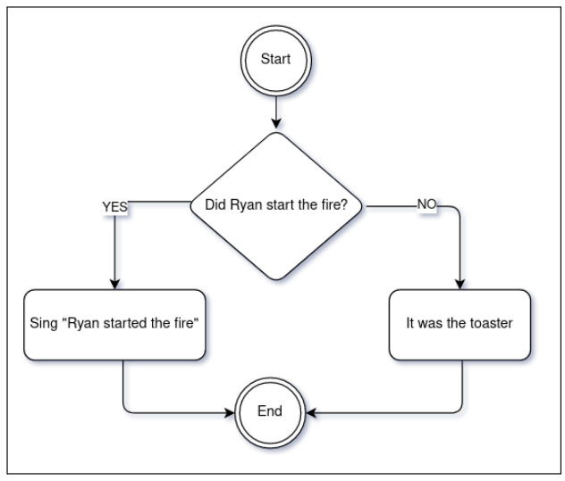

============
Conditionals
============

This is a very basic and essential logical concept used in programming. It's used to represent decision trees. 
Consider this diagram example as a decision tree:

In programming, "Did Ryan start the fire?" could be represented as a boolean variable. 
If True, then the result could be the string "Sing 'Ryan started the fire' ". But if False, then "It was the toaster".
Let's hop into some Python examples:

.. code-block:: python
   :linenos:

    ream_paper_price = 40.0

    # This evaluates to a boolean (True/False)
    if ream_paper_price > 10.0:
        percent_discount = 20.0
    else:
        percent_discount = 10.0

    final_ream_paper_price = ream_paper_price * (100 - percent_discount) / 100 
    message = f"The final price for a ream of paper is € {final_ream_paper_price} ({ream_paper_price} - {percent_discount}%)"

    print(message) # => The final price for a ream of paper is € 32.0 (40.0 - 20.0%)

In this example we are using the ``if`` and ``else`` keywords as a decision tree about a discount to be applied. 
In other words: if ``ream_paper_pric``e is greater than 10.0, then ``percent_discount`` is 20.0. Otherwise (that's what ``else`` means), ``percent_discount`` is 10.0. 
In our case the condition is ``True`` (40.0 > 10.0), so ``percent_discount`` is 20.0. 
The remaining part is a pure mathematical operation to get the final price with the discount applied.
But what if the decision tree requires more than two possibilities? That's where the ``elif`` keyword comes in:

.. code-block:: python
   :linenos:

    sales = 1200.0

    if sales >= 1000.0: # Possibility A
        bonus = 100.0
        message = f"Your bonus is € {bonus} and you get a trip to the Bahamas!"

    elif sales >= 500.0: # Possibility B
        bonus = 50.0
        message = f"Your bonus is € {bonus}."

    else: # Possibility C
        message = "You get no bonus..."

    print(message)  # => Your bonus is € 100.0 and you get a trip to the Bahamas!

In this example, there are three possibilities that will influence both ``bonus`` and ``message`` variables according to the value of ``sales``:
  
- Possibility “A”: if >= 1000.0, then ``bonus`` is 100.0
- Possibility “B”: if >= 500.0. Here we used the ``elif`` keyword, which roughly translates into “otherwise, if…”, then ``bonus`` is 50.0.
- Possibility “C”: if none of these 2 previous possibilities  are met, we use what is stated by the ``else`` keyword, that is the equivalent to saying "otherwise…", 
then there’s no bonus variable. That's the reason I didn't need to explicitly write ``elif sales < 500.0``, for instance, 
because this conclusion is already implicit. In other words, this possibility works as a fallback/default scenario

.. note::

    You may add ``elif`` multiple times for 4+ possibilities. Although there are better alternatives for that, such as match cases (See Match statement chapter), 
    dicts, or even ternaries (see next) in some situations.
