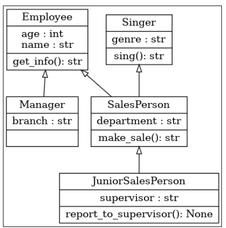

==================
Extra content
==================

This chapter explores some additional concepts to understand and others that can be implemented as supplements to your upcoming Python projects.

CLI - Command-Line Interface
---------------------------- 

As seen in the Loops chapter, you can have a Python program ask for a user’s input with the ``input()`` function. 
This kind of operation enables a wide range of possibilities for your programs, as you can have variables being dynamically set by the user, instead of hardcoding them.
Although in most real-life scenarios, these kinds of programs are often used in the context of task automation, 
where these arguments are passed in a slightly different way.

Try the following command:

.. code-block:: console

    $ python3 --help

You should see an output similar to this: 

.. code-block:: console

    Options (and corresponding environment variables):
    -b 	: issue warnings about str(bytes_instance), str(bytearray_instance)
            and comparing bytes/bytearray with str. (-bb: issue errors)
    -B 	: don't write .pyc files on import; also PYTHONDONTWRITEBYTECODE=x
    -c cmd : program passed in as string (terminates option list)
    -d 	: turn on parser debugging output (for experts only, only works on
            debug builds); also PYTHONDEBUG=x
    […]

This output shows many parameters/options (also known as flags) that can be passed into Python. 
You have already used these flags when you created a virtual environment ( the ``-m`` flag, in this case).

This example shows how a CLI program is used to get arguments from the user, directly from the command-line.
Next, you will see how to create your own CLI programs in Python using different approaches:

Sys module
---------------

This built-in module is the most basic approach:

.. code-block:: python
   :linenos:

    import sys

    arguments = sys.argv

    help_message = """Arguments. In this order:
    name (string)
    age (int)"""

    if len(arguments) != 3:
        print(help_message)
        sys.exit()

    name, age = arguments[1:3]

    print(f"My name is {name}, and I am {age} yo")

Sample usage:

.. code-block:: console

    $ python3 main.py Jim 35

Output:

.. code-block:: console

    My name is Jim, and I am 35 yo

Let’s see how it works:

``arguments``

Try to ``print()`` this variable. It’s a list containing the file name itself (``main.py``), 
plus the extra arguments passed into the program: ``[“main.py”, “Jim”, 35]``.

``if len(arguments) != 3``

You may add multiple parameters to the CLI program, which get appended to the ``sys.argv`` list. 
I am only interested in the second and third parameters (index 1 and 2 in the list). So if any other number of parameters gets passed, 
I want the program to display a help message (similar to the ``--help`` flag on Python’s CLI), then exit (``sys.exit()``) the program itself.

Argparse module
--------------------------

This module allows you to create more complex CLI’s, as it provides options for validating types, setting flags to the parameters, and more. 
As expected, the official documentation is very detailed: https://docs.python.org/3/library/argparse.html. 
So I decided to create a more basic example:	

.. code-block:: python
   :linenos:

    import argparse

    parser = argparse.ArgumentParser()

    parser.add_argument(
        "--branch",
        help="branch you work at",
        choices=["scranton", "stanford", "buffalo"],
    )
    parser.add_argument(
        "--name", help="your name", type=str, required=True, metavar="STRING"
    )

    parser.add_argument(
        "--sales", help="total in sales", type=float, default=0.0, metavar="FLOAT"
    )
    args = parser.parse_args()
    message = f"My name is {args.name}, I work at the {args.branch} branch. \
    My total in sales is {args.sales}"
    print(message)

In order to explain to the user how to use this program, the ``--help`` flag is available too. 
The same way you did to see all capabilities of Python’s CLI:

.. code-block:: console

    $ python3 main.py --help

Output:

.. code-block:: console

    usage: main.py [-h] [--branch {scranton,stanford,buffalo}] --name STRING [--sales FLOAT]

    options:
    -h, --help        	show this help message and exit
    --branch {scranton,stanford,buffalo}
                            branch you work at
    --name STRING     	your name
    --sales FLOAT     	total in sales

Third-party alternatives
---------------------------

In case the built-in argparse module doesn’t fit your needs, there are many third-party alternative libraries for creating professional CLI’s: 

- **Click** : https://click.palletsprojects.com (this is my go-to choice)
- **Typer**: https://typer.tiangolo.com
- **Fire**: https://github.com/google/python-fire			

Logging
----------------

As seen in the Error/exception handling chapter, many things could go wrong for a number of reasons during the execution of your Python programs. 
In many situations, these errors are expected to be more emphasized, or even recorded for further analysis. That’s where logging comes in. 
The official documentation page is very detailed: https://docs.python.org/3/howto/logging.html, so I decided to provide more context and show a basic use case. 
___________________________________________________________________

.. code-block:: python
   :linenos:

    import logging
    import sys

    LOG_TO_FILE = True

    logging.basicConfig(
        level=logging.DEBUG,
        format="%(asctime)s - %(levelname)s - %(message)s",
        filename="app.log" if LOG_TO_FILE else None,
    )

    def introduce(name: str) -> str:
        if not isinstance(name, str):
            function_name = sys._getframe().f_code.co_name
            logging.error(f"{name}: {type(name)} was passed to {function_name}()")

        return f"Hello, {name}"

    print(introduce(5))  # Passing an integer will trigger a log

Some details about the implementation:

``logging.basicConfig``

This is the configuration of the logs. Notice that ``logging.DEBUG`` was set to the ``level`` parameter. 
This is an important detail, because the logs are categorized in a hierarchy, according to the severity of each. 
From the lowest to the highest in severity: ``DEBUG``, ``INFO``, ``WARNING``, ``ERROR``, and ``CRITICAL``. 
The level you select will determine the other levels that will be caught. 
For instance, If you selected ``logging.ERROR`` instead, then only ``logging.ERROR`` and ``logging.CRITICAL`` would get caught. 
That’s why I picked the lowest ``logging.DEBUG`` level, so that all the other ones are caught too.

Note the special variables used in format: ``asctime``, ``levelname`` and ``message``. These variables are automatically inferred by the ``basicConfig()`` function. 
You will see their output right ahead.

Also note how ``LOG_TO_FILE`` is used in the ``filename`` parameter. If ``True``, the log will be saved to an ``app.log`` file, 
if ``False``, then the log will only be displayed in the console, similar to a ``print()``.

After running the program, notice that a new ``app.log`` file is created. Check its contents:

.. code-block:: console

    2025-10-01 13:16:03,554 - ERROR - 5: <class 'int'> was passed to introduce()

See how ``asctime``, ``levelname`` and ``message`` were used to customize a nice message saved to the log file!

Now, imagine a scenario where calling ``introduce()`` with an argument type other than a string will cause issues more ahead in your program. 
With this technique, you will have evidence of all the times this undesired situation happened, saved to a file for further inspection!

This was a naive example, but I hope you can see how this capability can be far more useful in situations where this kind of logs written are relevant or even crucial, 
such as for traceability of issues, auditing and monitoring the behavior of the program.

.. image:: https://media3.giphy.com/media/v1.Y2lkPTc5MGI3NjExN3ZvM2d0OTdmN3RubTFpbjlpYzkxM2Z2bzVmcDkwMHcyYmU0MHNidiZlcD12MV9pbnRlcm5hbF9naWZfYnlfaWQmY3Q9Zw/9psHrHyIXciY6lCz8B/giphy.gif
   :alt: Description of the animation
   :align: center
   
---------------------------

Memory management and garbage collection
-----------------------------

Throughout this book, you have seen the term “memory” being used a few times. Let’s talk about what it actually refers to.
In a typical program, you create variables, perform loops, open files, among others. 
Many of these operations require allocation/deallocation of actual memory space on your computer’s `RAM <https://en.wikipedia.org/wiki/Random-access_memory/>`_. 
If this task is not performed properly, your program may consume more memory than expected, cause memory leaks or even crash! 
So far, this doesn’t seem to be an issue with your Python programs, right? 
You haven’t had to explicitly allocate/deallocate memory on any occasion...
The reason is that in Python and in many other modern languages, this task is abstracted from the developer’s perspective, 
and handled by a component called garbage collector (GC). 

The GC keeps track of allocated objects in the program and identifies the ones that are no longer reachable or referenced, 
then it sweeps the memory and reclaims the occupied memory, making it available again for allocation.  

As an analogy, imagine you are running a catering service with a limited number of dishes available. 
People arrive in waves and take some dishes to use for their meal. Once a wave of people finish their meal and leave, 
you go around the dining area to collect and clean the dishes, so they can be reused by the next wave of people.  

As the popular saying goes, “there’s no free lunch” (no pun intended with the catering analogy). 
The GC itself costs memory! And it may reduce the performance of a program, as it may cause latency spikes in both RAM and CPU usage whenever it get triggered. 
It’s important to emphasize that this only becomes an issue in very specific scenarios where the performance of a program is a critical feature, 
such as **Artificial Inteligence/Machine Learning (AI/ML)** development, for example. In the majority of the cases, 
the GC does not cause any harm or delay to your programs. 

.. note::

    Other programming languages, such as ``C``, don’t rely on a GC, and therefore the memory management is handled manually by the developer. 
    An interesting alternative is the one implemented in the ``Rust`` language, with a concept called ownership and borrowing, 
    which is like a middle ground between manual and automatic memory management, without relying on a GC.

Mutability
--------------

This is a subject that is often overlooked in Python, which is unfortunate in my humble opinion, 
since not knowing about it might drastically change the behavior of your program! 

Mutability is the ability of an object to be modified after its creation. 
On mutable objects, you can change/mutate it by adding, removing or changing its attributes. 
On the other hand, if you try to do the same with an immutable object, a new object will be created, as a copy of the original one. 
This is a subtle detail that occurs implicitly, so it’s very easy to make mistakes if you are not aware of how it works. 
As an example, let’s demonstrate that an integer type is in fact immutable: 

.. code-block:: python
   :linenos:

    some_int = 5
    print(id(some_int))  # => 140505574154568
    some_int += 10
    print(id(some_int))  # => 140505574154888
    

In this case, I set 5 to ``some_int``, then printed its id. You may say that I modified ``some_int``, by incrementing it by 10, 
but notice that its id has changed in the second ``print()``. The ``id()`` function returns the memory address of an object, 
so if the id of ``some_int`` has “changed”, it means that a copy of this object has been created. 
Even if they have the same name, they are two separate objects, pointing to two separate memory addresses!

The importance of this concept is that a function may cause side effects to a variable passed as its argument, 
changing its value in an implicit way if the variable type is mutable. 
Let’s see a demonstration with Python’s built-in types regarding their mutability:

.. code-block:: python
   :linenos:

    some_str = "stanley"
    some_bytes = b"stanley"
    some_dict = {"age": 46}
    some_int = 10
    some_float = 20.0
    some_set = {30}
    some_list = [40]
    some_tuple = (50,)

    def try_to_mutate(x):

        object_type = x.__class__.__name__

        match object_type:
            case "int":
                x += 1
            case "float":
                x += 2.0
            case "list":
                x += [1, 2]
            case "str":
                x += "HUDSON"
            case "tuple":
                x += (1, 2)
            case "set":
                x.add(4)
            case "bytes":
                x += b"HUDSON"
            case "dict":
                x["name"] = "michael"
            case _:
                raise Exception(f"Unexpected type: {type(x)}")
        return x

    variables = [
        some_str,
        some_bytes,
        some_dict,
        some_int,
        some_float,
        some_set,
        some_list,
        some_tuple,
    ]

    for i in variables:
        object_type = i.__class__.__name__

        print(object_type.upper())

        print(
            f"The 'x' variable passed as argument to the function has value: {i} and ID: {id(i)}."
        )

        returned_value = try_to_mutate(i)

        id_conclusion = (
            "the same ID" if returned_value is i else f"ID: {id(returned_value)}"
        )

        print(
            f"The function returned an object with value: {returned_value} and {id_conclusion}."
        )

        variable_value_conclusion = (
            f"is changed to: {returned_value}"
            if returned_value == i
            else f"remains with the same value: {i}"
        )

        print(f"From now on, 'x' {variable_value_conclusion}.")

        mutability_conclusion = "Mutable" if i is returned_value else "Immutable"

        print(f"Conclusion: {mutability_conclusion}\n")

.. note::

    In both ``id_conclusion`` and ``mutability_conclusion`` ternary variables I used the is operator, 
    which validates if the compared objects point to the same memory address. It’s the same as: ``id(<object_1>) == id(<object_2>)``. 
    This concept is explained in the Operators chapter.

Now let’s see the output of this program:

.. code-block:: console

    STR
    The 'x' variable passed as argument to the function has value: stanley and ID: 140101440974960.
    The function returned an object with value: stanleyHUDSON and ID: 140101419100720.
    From now on, 'x' remains with the same value: stanley.
    Conclusion: Immutable

    BYTES
    The 'x' variable passed as argument to the function has value: b'stanley' and ID: 140101440776560.
    The function returned an object with value: b'stanleyHUDSON' and ID: 140101419155200.
    From now on, 'x' remains with the same value: b'stanley'.
    Conclusion: Immutable

    DICT
    The 'x' variable passed as argument to the function has value: {'age': 46} and ID: 140101440974848.
    The function returned an object with value: {'age': 46, 'name': 'michael'} and the same ID.
    From now on, 'x' is changed to: {'age': 46, 'name': 'michael'}.
    Conclusion: Mutable

    INT
    The 'x' variable passed as argument to the function has value: 10 and ID: 140101446672872.
    The function returned an object with value: 11 and ID: 140101446672904.
    From now on, 'x' remains with the same value: 10.
    Conclusion: Immutable

    FLOAT
    The 'x' variable passed as argument to the function has value: 20.0 and ID: 140101440092496.
    The function returned an object with value: 22.0 and ID: 140101440092272.
    From now on, 'x' remains with the same value: 20.0.
    Conclusion: Immutable

    SET
    The 'x' variable passed as argument to the function has value: {30} and ID: 140101419027584.
    The function returned an object with value: {4, 30} and the same ID.
    From now on, 'x' is changed to: {4, 30}.
    Conclusion: Mutable

    LIST
    The 'x' variable passed as argument to the function has value: [40] and ID: 140101440975872.
    The function returned an object with value: [40, 1, 2] and the same ID.
    From now on, 'x' is changed to: [40, 1, 2].
    Conclusion: Mutable

    TUPLE
    The 'x' variable passed as argument to the function has value: (50,) and ID: 140101440770480.
    The function returned an object with value: (50, 1, 2) and ID: 140101419095552.
    From now on, 'x' remains with the same value: (50,).
    Conclusion: Immutable

Since we are on the subject, this is a good time to mention the built-in ``frozenset`` class, which is a way of creating an immutable set:

.. code-block:: python
   :linenos:

    some_set = {15}
    some_frozenset = frozenset(some_set)  # Immutable

    print(some_set == some_frozenset)  # => True

A similar thing can be done with a dict. You can make it “read-only”, so it can no longer be modified:

.. code-block:: python
   :linenos:
   
    import types

    employee = {"name": "jim", "age": 35}
    employee = types.MappingProxyType(employee)

    print(
        employee, employee["age"], type(employee)
    )  # => {'name': 'jim', 'age': 35} 35 <class 'mappingproxy'>

As you can see, technically, ``employee`` is no longer a dict, but a ``mappingproxy`` type, 
although we still can access its keys normally. The difference is that you can no longer modify it!

Quality standards
--------------------

Linting 
------------------

.. note::

    Now it's a good time to be in an activated Python virtual environment, because you'll install some third-party libraries!

Linting is a concept that exists in many languages, including Python. It’s the process of analyzing and checking a program for potential errors, 
stylistic inconsistencies and best practices. The purpose of this verification is to ensure quality, readability and maintainability of your programs. 
In other words, to make them more professional-looking.

A few popular “linters” for Python include: Pylint, Black, Flake8, PyFlakes and Ruff. 
I will use Pylint: https://pylint.org/. You can install it as a regular third-party library:

.. code-block:: console

    $ pip install pylint

The following program works normally, although it does not comply with some Python's conventions:

.. code-block:: python
   :linenos:

    import sys

    company = "dunder mifflin"

    def Greet(name: str) -> str:
        return name
    

Are you curious to see these non-followed conventions? Use Pylint’s CLI for that:

.. code-block:: console

    $ pylint main.py

Output:

.. code-block:: console

    main.py:1:0: C0114: Missing module docstring (missing-module-docstring)
    main.py:3:0: C0103: Constant name "company" doesn't conform to UPPER_CASE naming style (invalid-name)
    main.py:6:0: C0116: Missing function or method docstring (missing-function-docstring)
    main.py:6:0: C0103: Function name "Greet" doesn't conform to snake_case naming style (invalid-name)
    main.py:1:0: W0611: Unused import sys (unused-import)

    ------------------------------------------------------------------
    Your code has been rated at 0.00/10 (previous run: 0.00/10, +0.00)
    ___________________________________________________________________

As seen in the output, Pylint flagged 5 non-compliant situations! If you’ve read the Naming conventions chapter, 
then you know how to properly name functions, which is the situation described in *main.py:6:0: C0103*.

An interesting capability is customizing the non-compliant codes you want Pylint to flag. 
A flexible and convenient way to do it is by creating a configuration file. Create a file named ``.pylintrc`` (this name is required):
 
.. code-block:: rst

    [MESSAGES CONTROL]
    disable=C0114,C0116

    [REPORTS]
    output-format=colorized

In ``disable``, you set the comma-separated codes you wish Pylint to ignore. 
You can see the codes by inspecting Pylint’s output, as seen in the previous example. 
But those are only the ones flagged in your current program. In order to see all the available codes and their meaning:

.. code-block:: console

    $ pylint --list-msgs

The ``[REPORTS]`` section and output-format are an optional nice feature that displays the output in different colors.

Type checking
-------------------------

As seen in the Functions chapter, adding type annotations to a function’s parameters is optional, although highly recommended. 
Mypy: https://mypy.readthedocs.io/en/stable/ is a third-party library used to perform this validation. 
It also checks for regular variables that have had their type changed at some point (this might happen unintentionally, 
so it’s good to catch it beforehand). See this example:

.. code-block:: python
   :linenos:

    def greet_all(names: list[str]) -> None:
        for i in names:
            print(f"Hello, {i}")

    greet_all(["jim", "pam", "dwight"])
    greet_all([10, 20, 30])
    branch = "scranton"
    branch = 50

Type-checking this program with Mypy (installed with ``pip install mypy``):

.. code-block:: console

    $ mypy main.py

Output:

.. code-block:: console

    main.py:10: error: Argument 1 to "greet_all" has incompatible type "List[int]"; expected "List[str]"  [arg-type]
    main.py:12: error: Incompatible types in assignment (expression has type "int", variable has type "str")  [assignment]
    Found 2 errors in 1 file (checked 1 source file)

About the flagged errors:

``main.py:10``

This is pointing out that I called ``greet_all()`` with a list of integers. It works normally, but it’s probably not what the function was designed for...

``main.py:12``

This one is complaining about the ``branch`` variable. I initially set it as a string, but then I assigned the value of 50 (int) to it. 
Also works normally, but does it make sense? Probably not...

Generating UML class diagrams 
------------------------------------

By installing Pylint, you also have access to Pyreverse, which is a tool used to generate UML class diagrams. 
This is useful for educational and training purposes, as visualizing the relationships between classes as diagrams can help both 
technical and non-technical stakeholders better understand the project.

.. note::

    **UML - Unified Modeling Language**. It’s a standardized modeling language consisting of different diagram types, used for specifying, 
    documenting, and visualizing software artifacts.

This concept assumes you’ve read the Classes chapter. Let’s see how Pyreverse works:

.. code-block:: python
   :linenos:

    from pydantic import BaseModel

    class Employee(BaseModel):
        name: str
        age: int

        def get_info(self) -> str:
            return f"Employee: {self.name}, Age: {self.age}"

    class Manager(Employee):
        branch: str

    class Singer(BaseModel):
        genre: str
        
        def sing(self) -> str:
            return f"I sing {self.genre} music."

    class SalesPerson(Employee, Singer):
        department: str

        def make_sale(self) -> str:
            return f"{self.name} from {self.department} made a sale."

    class JuniorSalesPerson(SalesPerson):
        supervisor: str

        def report_to_supervisor(self) -> None:
            print(f"{self.name} is reporting to {self.supervisor}.")

.. note::

    I used Pydantic to create the classes as a personal preference. Feel free to use regular classes.

Now run Pyreverse like this:

.. code-block:: console

    $ pyreverse main.py -o png

A new ``classes.png`` file was created in your current directory. If you happen to get error messages about *graphviz*, 
you have to download and install it first:  https://graphviz.org/. Here’s the generated image:

Working with datasets (Excel, CSV, JSON, SQL)
----------------------------------------

Handling CSV, Excel and other files is one of the most popular and practical usages of Python programming. 
In fact, this is a skill that attracts many people to the language.

This is a very rich and vast subject. Exploring even the basics would easily take many chapters in this book. 
Despite that, let’s see how easy it is to open a CSV file in Python with different approaches. 

Built-in: csv library
-------------------------------

.. code-block:: python
   :linenos:

    import csv

    with open("my-file.csv", "r") as csv_file:
        reader = csv.reader(csv_file)
        
        for i in reader:
            print(i)

That will ``print()`` each line in the ``my-file.csv`` file.

Third-party options: Pandas and Polars
------------------------------------------

With some basic research, you will probably bump into the *pandas* third-party library to handle large datasets. 
It’s a very popular and powerful choice. Find more about it at: https://pandas.pydata.org/. 

An interesting alternative is *polars*: https://pola.rs. 
This is a newer library designed for high-performance data processing and analysis, and it’s also easier to use. 
I do recommend you give it a shot before jumping into *pandas*!

.. code-block:: python
   :linenos:

    import polars

    data = polars.read_csv("my-file.csv")
    print(data)

As you probably guessed, this will ``print()`` the contents of ``my-file.csv``.

Wrapping up
-------------------

.. image:: https://media3.giphy.com/media/v1.Y2lkPTc5MGI3NjExMnljeTNhcTd0cmo2MW5tampleWhtNTRpd3k5N3ZrMTE3dHdlOGQ5ayZlcD12MV9pbnRlcm5hbF9naWZfYnlfaWQmY3Q9Zw/GA1s4aZhfe5f2N3fFb/giphy.gif
   :alt: Description of the animation
   :align: center
   
---------------------------

I do believe this last chapter provides good insights on how Python programs are used in real scenarios, where more concerns are existent.
Now it’s time for a few closing words regarding this journey. For that, a few points that actually meant a lot to me throughout the writing of the book, 
that also motivated me to start writing it in the first place:

**Practice, practice and more practice**. This may seem obvious, but sometimes even the obvious needs to be reinforced. 
It's only through practicing the concepts that you will learn and start solving real-world problems with code. 
That's what programming is all about, by the way!

**Refactoring**. All the programming content you see online, in books (like this one), and in courses is curated! 
Someone took the time to make the code look that way... When we're developing a program, our minds wander, which is normal. 
As a result, the initial version of the program may not look "pretty." 
Refactoring means making the code more maintainable and readable for the future. 
The code you write today is likely to change, especially if you're working professionally. 
It's also likely that someone else will make those changes or that you'll need to modify someone else's code. 
That's why it's important to refactor your code whenever possible. Your coworkers and your future self will thank you! 

