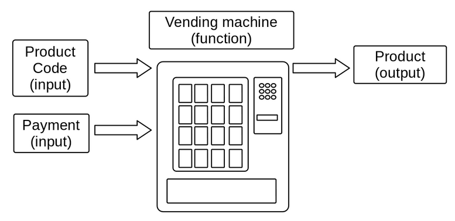

============================
Functions
============================

The concept of function in programming is derived from the mathematical concept with the same name. 
In mathematics, a function is a rule that maps a set of input values to a set of outputs.

As a real-world analogy, think of a function as a vending machine. In order to use it, you select the product you want and insert the payment. 
Both of them can be seen as the inputs. Then the machine processes them and gives you the desired product, which can be seen as the output of the function.

Functions in Mathematics
-------------------

As a basic example:

.. code-block:: rst

      f(x) = x + 2 

      Where:

      f: the name of the function
      x: the input
      x + 2: the output

In this case, the function f receives a number x and returns this same number plus two (x + 2).

Some examples of how this function can be used:

- f(1) = 3
- f(2) = 4
- f(10) = 12

Functions in Python
---------------------------

In programming, these input values are known as parameters, and the output is known as return.

This same function previously described can be represented in Python as such:

.. code-block:: python
   :linenos:

   def add_two(x: int) -> int: 
      return x + 2

   # This also works 
   def add_two_v2(x):
      return x + 2

   print(add_two(5))  # => 7 
   print(add_two_v2(5))  # => 7

Unlike the mathematical example, in programming we usually adopt more descriptive names for functions, so that a reader can infer what the function does just by looking at its name. 
Using phrasal verbs is a good approach, since functions typically perform some sort of action.

The ``print()`` command, that we have been using a lot throughout this book, is actually a function. 
It's a built-in function, which means it is natively available in any Python program.

In order to execute a function in Python, the function needs to be followed by parentheses enclosing any necessary arguments. 
This is known as "calling" a function:

.. code-block:: python
   :linenos:

   # here I am calling the print() function with "hello" as an argument
   print("hello")

Type hints
----------------

In the previous example, ``the add_two_v2()`` function does the exact same thing as ``add_two()``. 
The difference is that ``add_two()`` provides more explicit information by letting you know that the x parameter is an integer ``(x: int)`` 
and that it returns and integer as well ``(-> int)``. This approach of specifying the types of parameters and return values is known as "type hints". 
It improves readability, and is the convention adopted in the book.

Parameter vs argument in functions
----------------------

These terms are often used interchangeably, but they actually have different meanings. 
Parameter is a variable or placeholder that represents an input value that will be passed to the function.
Argument, on the other hand, is the actual value passed into a function when the function is called. See this example:

.. code-block:: python
   :linenos:

   def introduce_myself(name: str, age: int) -> str:
      return f"My name is {name}, and I am at least {age} years old"

   introduce_myself("Michael Scott", 46)

In this example, the ``introduce_myself()`` function accepts two parameters: ``name`` and ``age``. 
Then I called it with the arguments "Michael Scott" and 46, they became the values of the ``name`` and ``age`` parameters, respectively.

A function can accept multiple parameters with different types. Also, you can assign variables to function calls. See below:

.. code-block:: python
   :linenos:

   def introduce_myself(name: str, age: int) -> str:
      return f"My name is {name}, and I am at least {age} years old"

   # Assigning the return of calling "introduce_myself('Michael Scott', 46)" to the "introduction" variable:
   introduction = introduce_myself("Michael Scott", 46)

   print(introduction) # => My name is Michael Scott, and I am at least 46 years old

Speaking of parameter types, a parameter can be represented as multiple types simultaneously using the "|" operator. 
For example, the following function can accept a string, an integer, or a float as an argument:

.. code-block:: python
   :linenos:

   def handle_many_types(some_type: str | int | float) -> None:
      received_type = type(some_type) 	
      print(received_type)

   handle_many_types("jim") # => <class 'str'>
   handle_many_types(10) # => <class 'int'>
   handle_many_types(60.0) # => <class 'float'>

A Python function does not necessarily require parameters or an explicit return value. 
In the following example, there are no parameters, and it does not explicitly return anything, although it implicitly returns ``None``, 
which is a concept explained in the Absence of a value chapter.

.. code-block:: python
   :linenos:

   def say_hi():
      print("Hi")

   say_hi() #=> Hi
   print(say_hi())  # => None

.. note::

   Speaking of the ``return`` keyword, there is an essential aspect of this keyword that may not be obvious when you first start learning about functions: 
   whenever a function encounters a ``return`` statement, the function is exited immediately! As a result, anything written after a ``return`` statement will be ignored. 
   Take a moment to absorb this information.

Functions with a dynamic number of parameters
----------------------

First, take a look at this function:

.. code-block:: python
   :linenos:

   def greet(person_name: str) -> str:
      return f"Hello, {person_name}"

   # Non-named parameter
   print(greet("Michael"))

   # Named parameter. The parameter “name” is specified
   print(greet(person_name="Michael"))

As you can see, I can call the function either by simply passing "Michael", or by explicitly stating that the person_name parameter is "Michael".

Typically, that's how you call functions in Python. But in certain situations, you may want to enforce one approach over the other.

Understanding this concept is crucial to comprehend how it's also possible to call a Python function with a dynamic quantity of parameters.

With unnamed parameters (`*args`)
----------------------------------

Here's a function to be called with multiple unnamed parameters:

.. code-block:: python
   :linenos:

   def get_multiple_unnamed_parameters(*args):
      return args

   a = get_multiple_unnamed_parameters("Scranton", 10)
   b = get_multiple_unnamed_parameters(1, "Kelly", 52.5, True, [1,2])

   print(a) # => (Scranton, 10)
   print(b) # => (1, 'Kelly', 52.5, True, [1,2])
   print(type(a), type(b))  # => <class 'tuple'> <class 'tuple'>

Notice that in both calls to the get_multiple_unnamed_parameters() function, the arguments are not named (they are simply passed in a sequence). Also, notice that I called it with different quantities of arguments.

.. note::

   About ``*args``: this variable name is just a convention. Any other name can be used. The important part is the "*" before the name.

.. note::

   Note that the function above returned args as a ``tuple``. This is an important concept. You will learn about it in the Tuples chapter.

With named parameters (`**kwargs`)
-----------------------------

In a similar way, a function that requires multiple named parameters can be defined as such:

.. code-block:: python
   :linenos:

   def get_multiple_named_parameters(**kwargs):
      return kwargs

   a = get_multiple_named_parameters(name="Ryan", age=25)
   b = get_multiple_named_parameters(code=2, color="red", active=False)

   print(a) # => {'name': 'Ryan', 'age': 25}
   print(b) # => {'code': 2, 'color': 'red', 'active': False}
   print(type(a), type(b))  # => <class 'dict'> <class 'dict'>

.. note::

   About ``**kwargs``: this variable name is just a convention. Any other name can be used. The important part is the "**" before the name.

.. note::

   Note that the function above returns kwargs as a dict. This is an important concept. You will learn about it in the Dictionaries chapter.

Functions with default parameters
-------------------

It's also possible to set default values to function parameters, so that if the function is called without the arguments, the default values get used. 
But if the arguments are passed, they override the default ones.

In this following example, I am setting default values to both name and age parameters, but I decided to call the function by passing only the age parameter. As a result, the function call will take the default value for name and the passed argument value for age :

.. code-block:: python
   :linenos:

   def introduce_myself(name: str = "Darryl", age: int = 46) -> str:
      return f"My name is {name}, and I am {age} years old"

   print(introduce_myself(age=35)) # => My name is Darryl, and I am 35 years old

Functions as parameters
-------------------------

In Python, functions can also be used as parameters to other functions:

.. code-block:: python
   :linenos:

   def get_sum(x: int, y: int) -> int: 
      return x + y

   def get_multiplication(x: int, y: int) -> int: 
      return x * y

   def calculate(fun: callable, x: int, y: int) -> int: 
      return fun(x, y)

   calc_sum = calculate(get_sum, 5, 10) 
   calc_mult = calculate(get_multiplication, 5, 10)

   print(calc_sum) # => 15
   print(calc_mult) # => 50

In this example, ``calculate()`` is a function that receives a callable fun parameter ("callable" is the type hint for functions), plus two integers ``x`` and ``y``. 
Then, inside it, the fun function is called using x and y as arguments. Notice that now I can call calculate with both ``get_sum()`` and ``get_calculation()`` 
functions as arguments!

.. note::

   Another detail to pay attention to is the fact that when I call ``calculate()``, its argument functions ``get_sum`` and ``get_calculation`` are not called 
   (notice the absence of parentheses in the arguments). This means I am passing only a reference to these functions as arguments, 
   as opposed to the outputted result of calling them. In other words, if I passed ``get_sum(5,10)`` instead, it would be the same as passing the integer 15, 
   which is not what you want.

.. note::

   As you may have noticed, it would have made more sense to just call get_sum() and get_calculation() functions individually, rather than using this new calculate() function with them. But this is just a basic example to demonstrate the concept, which can be far more useful in other situations.

Documenting functions
----------------------

In certain situations, you may want to provide a clearer explanation of what a function does, its parameters, and its return values. 

Instead of using comments "#", the suggestion is that you use function documentation, also known as "docstrings". 
The syntax if very basic: the first string you place after the function definition will be treated as its documentation:

.. code-block:: python
   :linenos:

   def add(a: int, b: int) -> int: 
         """
         Add two numbers and return the result.

         Parameters:
         a (int): The first number to add. b (int): The second number to add.

         Returns:
         int: The sum of a and b. 
         """
      return a + b

   # This can be used to output the function's docstring 
   print(add.__doc__)

.. note::

   If you are using an IDE or other text editor with support for docstrings, you should also be able to see this documentation by hovering over the function's definition with your mouse pointer.

Anonymous/lambda functions
-----------------------------

In many programming languages there's this special kind of function called "anonymous functions". In Python, they are known as "lambda" functions. 
Basically they are used for writing short operations. Its syntax is: ``lambda <parameters> : <returned expression>``.

The syntax of a lambda function may look unfamiliar at first glance, so let's go through some examples in order to make it clearer:

.. code-block:: python
   :linenos:

   add_two = lambda x: x + 2 
   multiply_two_numbers = lambda x, y: x * y
   get_stanley_only = lambda x: "stanley hudson" if x == "sh" else None

   print(add_two(5)) # => 7 
   print(multiply_two_numbers(5, 2)) # => 10
   print(get_stanley_only("sh")) # => stanley hudson 
   print(get_stanley_only("ms")) # => None

About the lambda functions in the previous example:

``add_two``

Receives one parameter ``x`` and returns ``x`` plus 2.

``multiply_two_numbers``

Receives two parameters ``x`` and ``y`` and returns ``x`` multiplied by ``y``. 

``get_stanley_only``

Receives a parameter ``x`` and returns either "stanley hudson" (if ``x`` is equals to "sh"), or ``None`` (if ``x`` is any other value).

Function chaining
-----------------

It’s also possible to attach the return of a function to another function, making them work as a chain:

.. code-block:: python
   :linenos:

   # CASE 1
   last_letter_upper = "a-c".replace("c", "b").upper().split("-").pop()
   print(last_letter_upper) #=> “B”

   # CASE 2
   starts_with_1 = int(40).__add__(60).__str__().startswith("1")
   print(starts_with_1) #=> True 

``CASE 1``

I am replacing “c” with “b”, then turning the string into uppercase. The ``split()`` function turns the string into a list, 
separating the elements by “-”, which returns ``list([“A”,”B”])``. Finally, ``pop()`` returned the last element of the list. 
So, 4 functions were chained to output the desired result!   

``CASE 2``

Now I am adding 60 to 40, which outputs 100. Then turning it into a string, then checking if this string starts with “1”, which is ``True``. 
